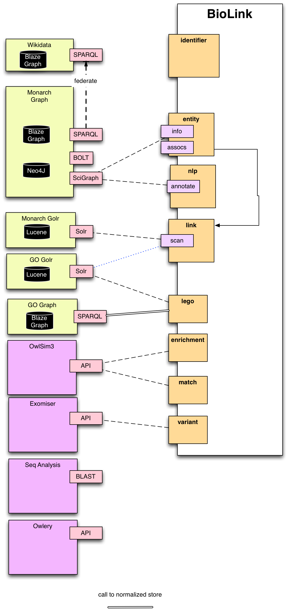

# BioLink API 
[](https://travis-ci.org/biolink/biolink-api)

An API providing access to information on biologically and
biomedically relevant entities, and the relationships between them, including:

 * genes, gene products, proteins
 * diseases, phenotypes, traits and clinical measurements
 * pathways, biological process
 * substances: small molecules, drugs, chemical entities
 * biological and molecular roles and activities
 * genotypes, alleles, sequence variants; for plants, germplasms
 * environmental contexts and exposures
 * individual organisms: patients, cohorts, model organisms
 * cell lines and cell types
 * investigations: experiments, clinical trials and 'natural experiments'
 * genomic features
 * phylogenies
 * metadata: publications, ontology terms, database metadata, prefixes

This repository provides an example server for the biolink API. This
can be customized for other sources; or an entirely new implementation
conforming to the API can be created.

## Demo

This API is designed to be implemented or partially implemented via a
variety of databases.

The Monarch instance provides access to a wide variety of aggregated
data:

http://api.monarchinitiative.org/api/

Note this instance also provides access to GO annotations.

## Running the server

After checking out this repo:

```
./start-server.sh
```

This uses gunicorn and starts a server on 8888 by default. pyvenv is
activated automatically.

Then look at:

http://localhost:8888/api/

For the swagger docs

To run in development mode:

```
pyvenv venv
source venv/bin/activate
pip install -r requirements.txt
export PYTHONPATH=.:$PYTHONPATH
python biolink/app.py
```

## Running with Docker

Docker requires a config directory with an
ontobio config file named ontobio-config.yaml
and a biolink config file named biolink-config.yaml

For testing purposes these can be copied from the defaults, eg

```
mkdir config
cp conf/config.yaml config/biolink-config.yaml
cp venv/lib/python3.7/site-packages/ontobio/config.yaml config/ontobio-config.yaml
```

```
docker build -t biolink-api .
docker run -p 5000:5000 -v `pwd`/config:/config biolink-api start-server -k gevent --worker-connections 5 --bind 0.0.0.0:5000 wsgi:app
```

## Datamodel

See the swagger UI for more details. Click on 'model' under any of the routes.

The primary abstraction used in the modeling is the distinction
between _named objects_ and _associations_.

 * Named objects include things like genes, drugs, pathways.
    * specific types subclass from a more generic type
 * Associations connect these, usually via some _evidence_ and provenance information.
    * Some associations can be direct, others are indirect or *inferred*
    * Where associations are inferred, these is a *graph of evidence* tracing the primary associations

## Examples

See [EXAMPLE-QUERIES.md](EXAMPLE-QUERIES.md)

These examples are compiled from the [behave tests](tests/)


# Contributing to BioLink-API

This is the repo:

https://github.com/biolink/biolink-api/

You can run a server instance locally with very little effort (less
than one minute), see below:

## Dependencies

This server implementation is primarily a flask-rest wrapper onto the
[ontobio](https://github.com/biolink/ontobio) package.

## Goals

This API will wrap and integrate number of different more modular APIs
and database engines or analysis services. The idea is that the API
implementation will do the right thing - for example, using Solr for
searches but injecting results with fast in-memory traversal of
ontology graphs.

## Client API Libraries

A service implementing the Biolink API can be accessed through
standard http libraries. We also provide client language bindings,
generated through swagger-codegen. For more information, see:

[ClientAPIs](https://github.com/biolink/biolink-api/wiki/ClientAPIs)

## Implementation and Project Organization

This is intended as a think wrapper layer, integrating existing
services, as shown here:




